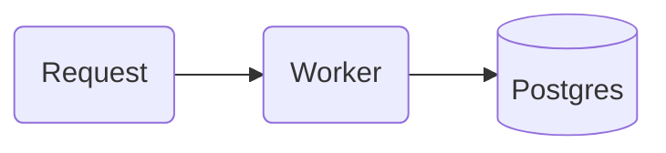

# mermaid

Renders Mermaid with `beautiful-mermaid` into a responsive, light-palette SVG with no external font imports.

## Use

- In Markdown (chat answers, docs, notes, SKILL.md pages) write a fence — it renders inline; if it fails to compile the block stays visible as code:

- `mermaid.render({ source })` → HTML fragment `
…<svg>…
`.

Palette classes: `red`, `blue`, `violet`, `green`, `yellow`, `neutral` with a stroke width digit — `A:::blue2` or `class A red1`; the `classDef` is injected unless you write your own.

Mermaid decides the layout itself. For diagrams where you must say what sits where, use the `reladraw` plugin.
