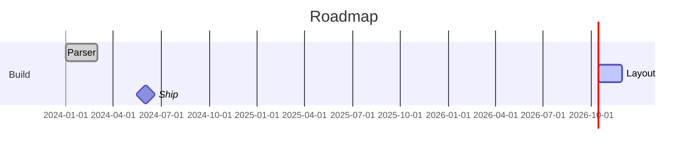
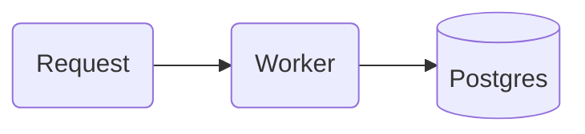

# mermaid

Renders Mermaid with `beautiful-mermaid` into a responsive, light-palette SVG with no external font imports.

Twenty diagram types are supported:

- **Graphs** — `flowchart`, `stateDiagram-v2`, `sequenceDiagram`, `classDiagram`, `erDiagram`, `gitGraph`, `block-beta`, `mindmap`, `requirementDiagram`, `C4Context` (and `C4Container` / `C4Component` / `C4Dynamic` / `C4Deployment`)
- **Time** — `gantt`, `timeline`
- **Quantities** — `xychart-beta`, `pie`, `sankey-beta`, `radar-beta`, `treemap-beta`, `quadrantChart`
- **Boards** — `journey`, `kanban`

A project plan, a roadmap or a career history belongs in a `gantt` fence — it takes real dates and draws a real time axis, so there is no reason to reach for a chart library:

## Use

- In Markdown (chat answers, docs, notes, SKILL.md pages) write a fence — it renders inline; if it fails to compile the block stays visible as code:

- `mermaid.render({ source })` → HTML fragment `
…<svg>…
`.

Palette classes: `red`, `blue`, `violet`, `green`, `yellow`, `neutral` with a stroke width digit — `A:::blue2` or `class A red1`; the `classDef` is injected unless you write your own.

Frontmatter works too — `---\ntitle: …\nconfig: { … }\n---` before the diagram, and `accTitle:` / `accDescr:` become the SVG `<title>` and `<desc>`.

Mermaid decides the layout itself. For diagrams where you must say what sits where, use the `reladraw` plugin.
