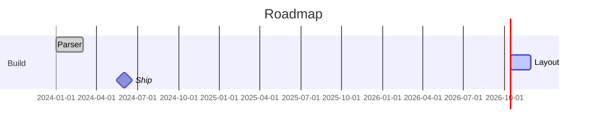
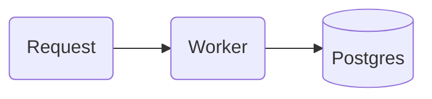
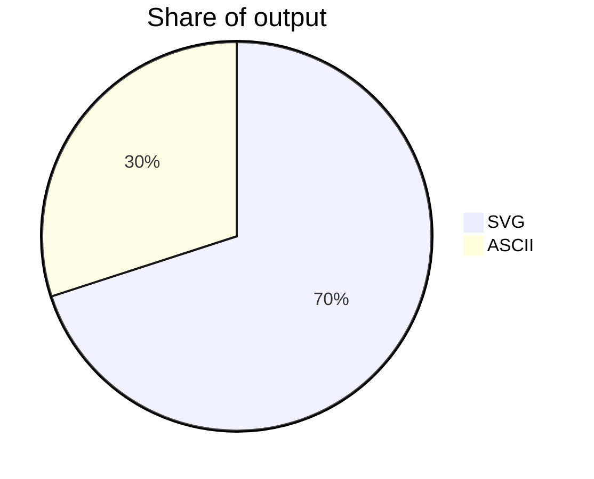

# mermaid

Renders Mermaid with `beautiful-mermaid` into a responsive, light-palette SVG with no external font imports.

Twenty diagram types are supported. Pick by what the picture has to say, not by what is familiar:

| Header | Draws | Reach for it when |
| --- | --- | --- |
| `flowchart` | boxes and arrows, auto-placed | a process, a pipeline, a decision tree |
| `sequenceDiagram` | lifelines and messages in order | who calls whom, and in what order |
| `stateDiagram-v2` | states and transitions | a machine with modes and events |
| `classDiagram` | types, fields, relations | a data model or an API's shape |
| `erDiagram` | entities and cardinality | database tables and their keys |
| `gitGraph` | commits, branches, merges | explaining a branching strategy |
| `block-beta` | a fixed grid of blocks | an architecture slide, layers in columns |
| `mindmap` | a radial tree | breaking one idea into parts |
| `requirementDiagram` | requirements and what satisfies them | traceability: asked for vs provided |
| `C4Context` | people, systems, nested boundaries | software architecture at one zoom level (also `C4Container`, `C4Component`, `C4Dynamic`, `C4Deployment`) |
| `gantt` | bars on a real date axis | a plan, a roadmap, a history — **anything with dates** |
| `timeline` | events along one line | a sequence of moments, no durations |
| `xychart-beta` | bars and lines on x/y | a measured series |
| `pie` | slices of one whole | parts of a total, few categories |
| `sankey-beta` | weighted flows | where a quantity goes as it moves |
| `radar-beta` | one closed curve per series | comparing several things on the same axes |
| `treemap-beta` | nested rectangles by area | a hierarchy where size is the point |
| `quadrantChart` | points in a 2×2 grid | a position in the unit square (effort vs value) |
| `journey` | steps scored by sentiment | a user's path and where it hurts |
| `kanban` | columns of cards | state of work in progress |

A project plan, a roadmap or a career history belongs in a `gantt` fence — it takes real dates and draws a real time axis, so there is no reason to reach for a chart library:

## Use

- In Markdown (chat answers, docs, notes, SKILL.md pages) write a fence — it renders inline; if it fails to compile the block stays visible as code:

- `mermaid.render({ source })` → HTML fragment `
…<svg>…
`.

Palette classes: `red`, `blue`, `violet`, `green`, `yellow`, `neutral` with a stroke width digit — `A:::blue2` or `class A red1`; the `classDef` is injected unless you write your own.

Frontmatter works too, and `accTitle:` / `accDescr:` become the SVG `<title>` and `<desc>`:

Mermaid decides the layout itself. For diagrams where you must say what sits where, use the `reladraw` plugin.
